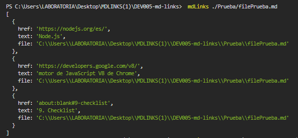
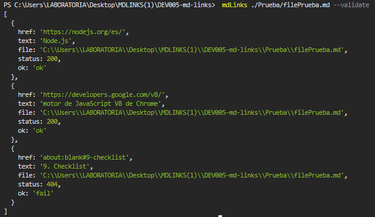
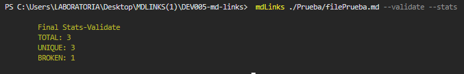
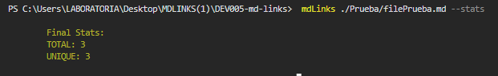
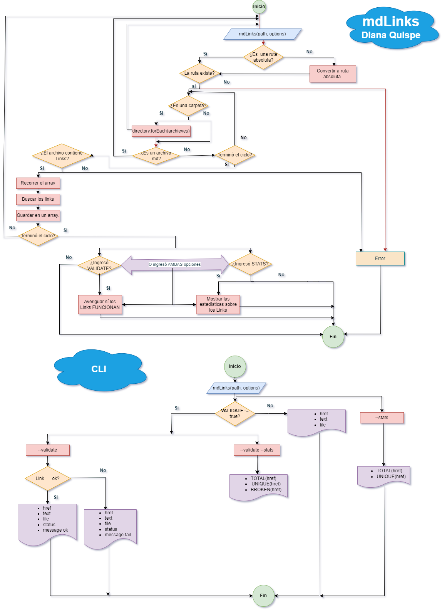

<h1><center> Markdown Links📄🔗 </center></h1>

---

## Índice

1. Preámbulo
2. Descripción de mdLinks
3. Cómo instalarlo?
4. Opciones de uso
5. Plan de acción para el desarrollo
6. Checklist

---

## 1. Preámbulo

[Markdown](https://es.wikipedia.org/wiki/Markdown) es un lenguaje de marcado
ligero muy popular entre developers. Es usado en muchísimas plataformas que
manejan texto plano (GitHub, foros, blogs, ...) y es muy común
encontrar varios archivos en ese formato en cualquier tipo de repositorio
(empezando por el tradicional `README.md`).

Estos archivos `Markdown` normalmente contienen *links* (vínculos/ligas) que
muchas veces están rotos o ya no son válidos y eso perjudica mucho el valor de
la información que se quiere compartir.

Dentro de una comunidad de código abierto, nos han propuesto crear una
herramienta usando [Node.js](https://nodejs.org/), que lea y analice archivos
en formato `Markdown`, para verificar los links que contengan y reportar
algunas estadísticas.


## 2. Descripción de mdLinks

mdLinks es una biblioteca creada con JavaScript y Node.js, con la que es posible identificar si el archivo pasado a través de una ruta con formato .md a partir de una ruta dada, esta ruta puede ser un archivo o un directorio, revisando si contiene enlaces, si la búsqueda anterior resulta positiva la misma permite validar el estado de los links y también tiene la posibilidad de retornar estadísticas básicas como: links totales, únicos y rotos.

## 3. Cómo instalar mdLinks?

Para hacer uso de la libreria por línea de comando: 
- Escribe en la terminal:

👉 `npm install ladydi3103-mdlinks -g`

Para hacer uso de la libreria directamente en el proyecto:
- Escribe en la terminal:

👉 `npm install ladydi3103-mdlinks`

Luego importar con:
```js
const { mdLinks } = require("ladydi3103-mdlinks");

```

### API `mdLinks(path, opts)`

#### Ejemplo de cómo usarlo:

```js
const mdLinks = require("md-links");

mdLinks("./some/example.md")
  .then(links => {
    // => [{ href, text, file }]
  })
  .catch(console.error);

mdLinks("./some/example.md", { validate: true })
  .then(links => {
    // => [{ href, text, file, status, ok }]
  })
  .catch(console.error);

mdLinks("./some/dir")
  .then(links => {
    // => [{ href, text, file }]
  })
  .catch(console.error);
```

## 4. Opciones de uso

### CLI (Command Line Interface - Interfaz de Línea de Comando)
Para hacer la consulta por la línea de comando, tendrás las siguientes opciones:

```js
-----------------------------------------------------------------------
🆘🆘🆘🆘🆘🆘🆘🆘🆘🆘🆘🆘🆘  HELP 🆘🆘🆘🆘🆘🆘🆘🆘🆘🆘🆘🆘🆘
-----------------------------------------------------------------------
***********************************************************************
HOLA!!! 😁 
Recuerda que la estructura que debes seguir es la siguiente:
👉 mdLinks <path-to-file> [options]

    EJEMPLOS:
    mdLinks ./pruebas/file1.md
    mdLinks ./pruebas/file1.md --validate
    mdLinks ./pruebas/file1.md --validate --stats
    mdLinks ./pruebas/file1.md --stats

-----------------------------------------------------------------------
👉 La descripción de [options] con respecto a los resultados
    que puedes obtener es la siguiente:

    OPTIONS

    ⭐ --validate
            * href: URL encontrada
            * text: Texto que aparecía dentro del link.
            * file: Ruta del archivo donde se encontró el link.
            * status: Código de respuesta HTTP.
            * ok: Mensaje fail en caso de fallo u ok en caso de éxito.

    ⭐ --stats
            * Total: Total de links encontrados.
            * Unique: Total de links únicos encontrados.
    
    ⭐ --validate --stats || --stats --validate
            * Total: Total de links encontrados.
            * Unique: Total de links únicos encontrados.
            * Broken: Total de links rotos.

************************************************************************ 
```

`mdLinks <path-to-file> [options]`

Ejemplo:
```js
mdLinks ./Prueba/filePrueba.md
```



Ejemplo:
```js
mdLinks ./Prueba/filePrueba.md --validate
```



Ejemplo:
```js
mdLinks ./Prueba/filePrueba.md --validate --stats
```



Ejemplo:
```js
mdLinks ./Prueba/filePrueba.md --stats
```



---

## 5. Plan de acción para el desarrollo

- En este proyecto nos recomendaron usar la herramienta de planificación y organización de GitHub llamada **Github Projects** para que mediante **issues** y **milestones** podamor organizar y planificar tareas y objetivos concretos. 

- Se realizaron dos diagramas de Flujo para el API y CLI y asi poder visualizar y planificar las tareas y objetivos para estructurar lo que se tiene que hacer y cumplir los objetivos.

### Diagramas de Flujo



## 6. Checklist

### General

* [😊] Puede instalarse via `npm install --global ladydi3103-mdlinks`

### `README.md`

* [😊] Un board con el backlog para la implementación de la librería.
* [😊] Documentación técnica de la librería.
* [😊] Guía de uso e instalación de la librería

### API `mdLinks(path, opts)`

* [😊] El módulo exporta una función con la interfaz (API) esperada.
* [😊] Implementa soporte para archivo individual
* [😊] Implementa soporte para directorios
* [😊] Implementa `options.validate`

### CLI

* [😊] Expone ejecutable `md-links` en el path (configurado en `package.json`)
* [😊] Se ejecuta sin errores / output esperado
* [😊] Implementa `--validate`
* [😊] Implementa `--stats`

### Pruebas / tests

* [😊] Pruebas unitarias cubren un mínimo del 70% de statements, functions,
   lines, y branches.
* [😊] Pasa tests (y linters) (`npm test`).
